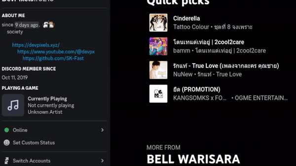

# 🐧 Linux Currently Playing
Display your media as Discord activity for Linux.

<div align="center">



</div>

# 💻 Running
#### ❗ **Non debian based distros note.**
For non debian based distros. This program will install **playerctl** automatically on Debian. You'll have to manually install it for other distros.


## Grabbing from releases
You can grab the latest release [here](https://github.com/SK-Fast/song-linux-discord-rpc/releases/)

## Directly from the source code
Requirements
-  nodejs, npm
-  playerctl

```
npm install
npm start
```

# 📦 Building
-  nodejs, npm
-  playerctl

```
npm install -g pkg
npm install
npm run build
```

# 🤔 How it works
This NodeJs program gather media metadata from playerctl and update it with discord-rich-presence. So the song information is shown in your Discord profile automatically 

<hr/>
<center>
pixels opensource<br>
with :trollface: at 🇹🇭
</center>